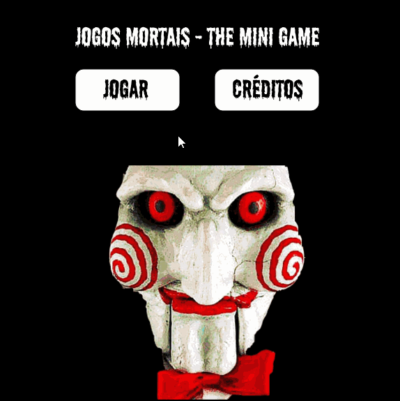

# 🕹Mini Game Jogos Mortais



## Idealização

Este mini game foi idealizado durante a Aula Inaugural técnica do [Curso de Desenvolvimento de Software Full-Stack da Cubos Academy](https://cubos.academy/cursos/desenvolvimento-de-software).

A ideia inicial do game seria para testar o poder da biblioteca P5js e os conhecimentos básicos em JavaScript e assim veio a ideia de um simples game com a temática dos Jogos Mortais, onde você deve conseguir fugir das armadilhas do John Kramer e chegar à "Porta da Liberdade".

O game foi feito durante a aula, ou seja, é ainda algo bem embrionário. Espero, até o final do curso, desenvolver ainda mais habilidades em JavaScript para melhorar este projeto.


## Pré-Requisitos

- Um navegador atualizado e moderno como o Brave, Chrome, Firefox, etc.
- Computador... 😁


## Iniciar

**1.** Fork [este](https://github.com/peucabral85/curso-fullStackT16-cubosAcademy) repositório 🍴

**2.** Clonar o repositório em seu sistema local 👥

```
git clone https://github.com/peucabral85/curso-fullStackT16-cubosAcademy.git
```


Ou realizar Download e extrair o arquivo zip.


## Jogar

**1.** Acesse o diretório: un01/semana01/18_01-AulaTecnInaugural/Mini_Game_Jogos_Mortais

**2.** Abra o arquivo index.html com o [plugin Live Server no VS Code](https://marketplace.visualstudio.com/items?itemName=ritwickdey.LiveServer) ou com a [extensão Live Server do Chrome](https://chromewebstore.google.com/detail/live-server-web-extension/fiegdmejfepffgpnejdinekhfieaogmj).


## Ideias para o futuro

A ideia é que sejam implementados níveis de dificuldade no código do game. Atualmente as armadilhas movem-se sem parâmetro, através da função ramdon(). A ideia é que as movimentações das armadilhas sejam "inteligentes" e não randômicas, proporcionando dificuldade ao gamer.


## Código construído com

- [HTML](https://www.html.com/) - Linguagem de marcação padrão.
- [JS](https://www.javascript.com/) - Linguagem de programação interpretada de alto nível.
- [P5JS](https://p5js.org/) - É uma biblioteca JavaScript para codificação criativa, com foco em tornar a codificação acessível e inclusiva.

## Autor

- **[Pericles Cabral](https://github.com/peucabral85)**


## Agradecimentos

[Cubos Academy](https://cubos.academy/)

[Franquia Saw (Jogos Mortais)](https://www.lionsgate.com/franchises/saw)
